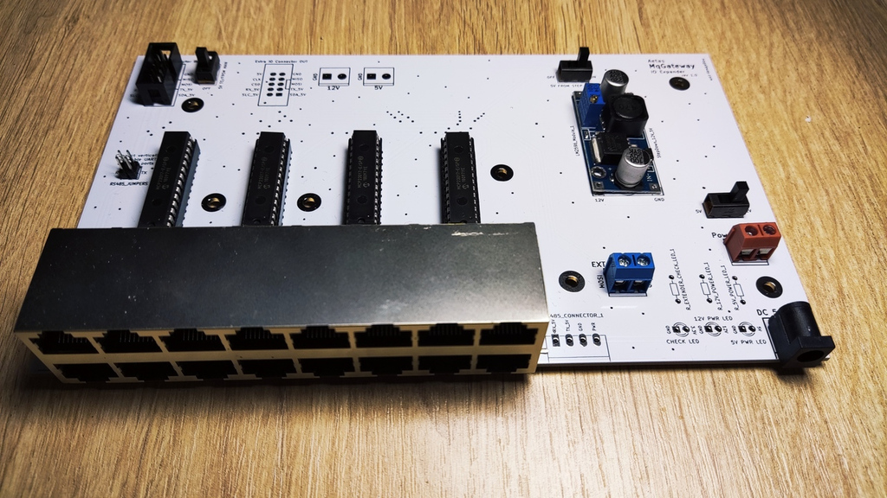

# I/O Expander Board

!!! info
    To use I/O Expander board, you need to enable it in MqGateway software configuration. 
    More info in [System configuration section](../user-guide/configuration.md#system-configuration)

**I/O Expander Board** provides 16 additional ports to connect digital and complex devices. It doubles the number of digital input/output ports
available on the [Main Board](board-layout.md).

This board also adds RS485 bus functionality to MqGateway. It means you can connect up to 63 devices communicating through RS485 bus.
These devices can optionally be powered with 12V instead of 5V which is a default for MqGateway.

!!! warning
    Basic support for I/O Expander in MqGateway is ready. It is possible to connect additional devices through additional RJ45 ports.
    However, **implementation to support RS485 bus is not ready yet**.     
    Please let me know [in the ticket](https://github.com/aetas/mqgateway/issues/28) if you are interested with this functionality. 

## Main components

Similar to the main board layout - four 16-channel port expanders MCP23017 has been used to supply 64 digital input/output ports. 
MCP23017 are connected by I2C from the main board.

UART/RS485 port pins are also provided from the main board.  
However, if the main board has MAX485 module installed, it is also possible to disable standard UART/RS485 ports in the RJ45 ports (using jumpers)
and enable RS485 communication bus.

Important (but optional) component of the board, is the step down converter from 12V to 5V. It makes possible to power the board with 12V and power 
the devices on the RS485 bus with 12V instead of 5V.   

PCB project in KiCAD and Gerber files are available on [GitHub](https://github.com/aetas/MqGateway-PCB).

## Connection and power supply

I/O Expander Board can be connected to MqGateway Mainboard with 10 pin IDC/ribbon cable. It should be connected by using:

- "Extra IO Connector" port on MqGateway Mainboard
- "Extra IO Connector IN" port on I/O Expander Board

There are few possible ways to supply power to both boards when using I/O Expander Board.

### Power with 5V from MqGateway I/O Expander Board

This is recommended solution. Use DC input on the right side of I/O Expander Board to supply 5V power to both boards.  
I/O Expander Board needs to have following switches set:

| Name of switch    | Position   |
|-------------------|------------|
| INPUT             | left (5V)  |
| 5V FROM STEP-DOWN | left (OFF) |
| 5V TO/FROM MAIN   | top (ON)   |

### Power with 5V from MqGateway Mainboard

Use DC input on the right side of Mainboard to supply 5V power to both boards.  
I/O Expander Board needs to have following switches set:

| Name of switch    | Position   |
|-------------------|------------|
| INPUT             | left (5V)  |
| 5V FROM STEP-DOWN | left (OFF) |
| 5V TO/FROM MAIN   | top (ON)   |

### Power with 12V from MqGateway I/O Expander Board

Use DC input on the right side of I/O Expander Board to supply 12V and power both boards.
This is the only setting where step down converter module  is required on the I/O Expander Board.  
I/O Expander Board needs to have following switches set:

| Name of switch    | Position    |
|-------------------|-------------|
| INPUT             | right (12V) |
| 5V FROM STEP-DOWN | right (ON)  |
| 5V TO/FROM MAIN   | top (ON)    |

## I/O RJ45 ports

These ports are the same as on the main board.
Sixteen RJ45 ports are responsible for input and output to sensors and devices like relays. Each port provides:

- power (+5V and GND)
- 4 digital input/output wires
- 2 wires used for UART TTL or RS485 communication (if RS485 bus is disabled).

See [wiring](wiring.md) page to learn more about RJ45 ports and role of each wire.

## RS485 bus

Looking at the RS485 Connector from front there are following connections (from left to right):

- RS485 B
- RS485 A
- power (GND)
- power (+5V or +12V)

## What's next?

- [See used components](bill-of-materials.md)
- [Quick start](../user-guide/quick-start.md)
- [Software installation](../user-guide/installation.md)